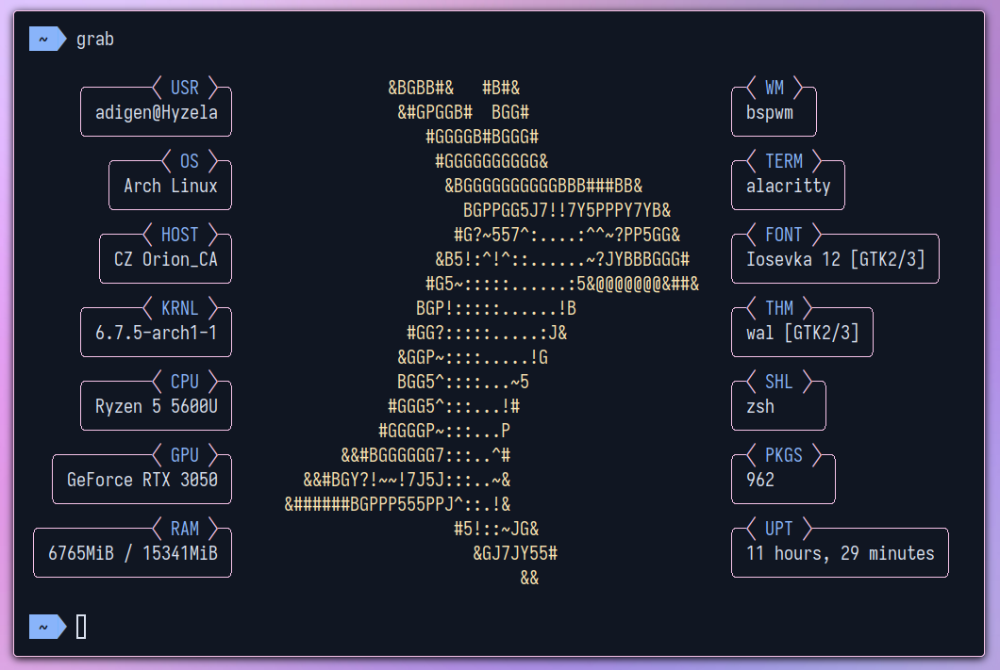

<div align="center">

# grab

</div>



<!--  -->

<div align="center">

## About

</div>

DISCLAIMER: grab is not fully complete yet, it is a WIP!

-   A fetch tool written in POSIX `sh` and `C++`

-   Meant for use in [StratOS](https://github.com/StratOS-Linux/StratOS-iso) (A Arch-based distro made by Linux hobbyists)

-   For further info on how to contribute to this project, refer to [CONTRIBUTING.md](CONTRIBUTING.md)

<div align="center">

## Tasks

</div>

-   [x] Fetch the info dynamically
-   [x] Cache the info for faster execution
-   [ ] Major code clean up (most likely a rewrite)
-   [ ] Configuration file
-   [ ] Testing on multiple systems

<div align="center">

## Why shell inside C++?

</div>

The C++ part handles all the layout calculations and printing. The shell script (under shell_script variable) is the script that fetches the info.

The reason for using a shell script for fetching is its simpler to expand on. Additionally shell scripts already exist for this job (making use of neofetch's functions here)

Printing in shell is simply too slow for such a cosmetic interface, hence the use of C++.

<div align="center">

## Contributing

</div>

`C++`: WIP

`sh`:

-   Functionalize everything in a format like:

```shell
# Description of function
# (paramters, asd=default_value)
function_name() {
    ...
}
```

-   For further info on how to contribute to this project, refer to [CONTRIBUTING.md](CONTRIBUTING.md)
